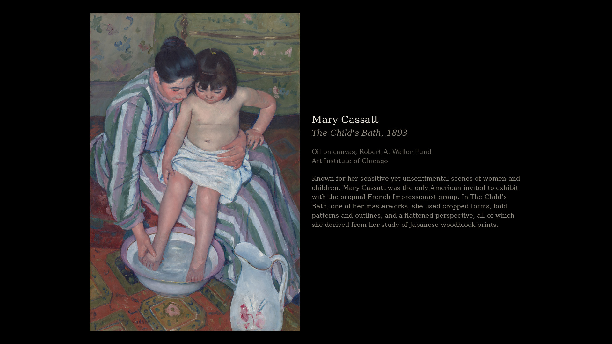
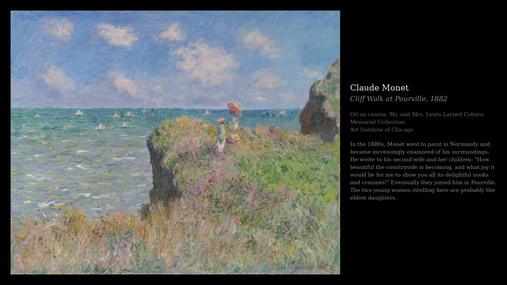

# frame-art

Fills a Samsung The Frame with public-domain museum paintings, each rendered
like a gallery wall with the artist, title, medium and curator's note beside
it. Runs unattended: it fetches, renders, uploads, rotates what's on the
wall, and swaps in a seasonal theme when the month turns.





*Mary Cassatt, The Child's Bath (1893) and Claude Monet, Cliff Walk at
Pourville (1882), both public domain, Art Institute of Chicago.*

## Why it exists

The Frame ships with an Art Store subscription. Everything it shows you
otherwise is a photo with a mount drawn round it. But the world's museums
have put hundreds of thousands of public-domain paintings online, in full
resolution, free, and a TV that hangs on a wall pretending to be a picture
ought to be showing those.

Three problems stand between the two, and this is the code for all three:

**Museums do not agree on anything.** The Art Institute has a real style
facet you can query exactly. The Met has none, spells its department names
differently from its own object records, and only honours search filters
when `q` is the first parameter. Cleveland calls its preservation TIFF
"full", and it can be 483 MB.

**A 16:9 panel and a portrait canvas cannot both win.** So the artwork is
fitted rather than cropped, on black, with the caption in whatever space is
left over: a column beside a portrait, underneath the right hand end of a
landscape.

**The TV is not very helpful.** It shows no metadata at all for an image you
upload, so the caption has to be part of the picture. Its art API
acknowledges writes that never take effect and reports state that is simply
wrong. Its slideshow settings need a Samsung account, so on a TV kept off
the internet they cannot be set at all.

## What it does

```
fetch_art.py       museum APIs   ->  library/raw/       + catalogue.json
prepare_images.py  library/raw   ->  library/prepared/  1920x1080, captioned
push_to_frame.py   prepared      ->  the TV, matte disabled
export_stills.py   prepared      ->  a share, for an Apple TV screensaver
make_slideshow.py  prepared      ->  an H.264 file, for a TV with no art mode
web/               catalogue     ->  a browsable gallery
```

Sources are the Art Institute of Chicago, the Metropolitan Museum of Art and
the Cleveland Museum of Art. All three are keyless, and only public domain
or CC0 works are ever downloaded.

## Rights in the artwork

The paintings are public domain. **The words are not necessarily.** The Art
Institute's API states that its `description` field is CC-BY while the rest
of its data is CC0, and blurbs come from `short_description` falling back to
`description`, so a caption can carry a CC-BY obligation even when the
painting it describes is centuries out of copyright. Every label names the
lending museum, which satisfies that and reads better anyway. Cleveland
reports CC0, and the Met's open access data is CC0.

No artwork is committed to this repository beyond the two examples above.

## Licence

[AGPL-3.0](LICENSE). Use it, change it, run it, put it on your own wall.

The one condition worth stating plainly: if you distribute a modified
version, **or run one as a network service**, the source has to stay open
under the same licence. That second clause is why this is AGPL rather than
GPL, since the thing ships a web gallery and plain GPL would let someone
host a closed fork of it.

This was built for love rather than money and there is nothing to monetise.
Commercial use is allowed; taking it proprietary is not.

If you run the gallery publicly, note that AGPL section 13 obliges you to
offer your users the source of *your* version. `web/static/index.html` has
a source link in it for exactly that reason; point it at your fork rather
than removing it.

## Getting started

You need a Samsung The Frame on the same network, Python 3.11 or newer, and
about ten minutes. The museum APIs are all keyless, so there is nothing to
sign up for.

**1. Install.**

```bash
git clone https://github.com/No1089/frame-art.git && cd frame-art
python3 -m venv .venv
./.venv/bin/pip install -r requirements.txt
```

Two things are system packages rather than pip ones. A serif font, or labels
fall back to a bitmap face and look it; and `ffmpeg`, only if you want the
video render.

```bash
sudo apt install fonts-dejavu-core ffmpeg     # Debian, Ubuntu
brew install ffmpeg                           # macOS already has fonts
```

**2. Tell it about your TV.** Create `config_local.py`, which is not
committed:

```python
TV_HOST = "10.0.0.5"    # your TV's address, ideally a DHCP reservation
HTTP_USER_AGENT = "frame-art-pipeline/1.0 (personal use; me@example.com)"
```

The Art Institute asks for a real contact so they can reach whoever is
hitting their API; use one. To find the TV, look for a device named after
the model in your router, then confirm it answers:

```bash
curl -s http://10.0.0.5:8001/api/v2/ | python3 -m json.tool
```

That endpoint needs no pairing and tells you the model, the panel resolution
and whether `FrameTVSupport` is true. **Check the resolution before anything
else**: the 32 inch Frame is 1920x1080 while every other size is 3840x2160,
and `TARGET_WIDTH_PX` in `config.py` assumes the former.

**3. Pair with the TV.** The first connection makes it show an allow prompt,
which you accept with the remote:

```bash
./.venv/bin/python push_to_frame.py --check
```

Leave the TV on, not powered down: The Frame drops off the network entirely
when it is off, and wake-on-LAN cannot help because the wifi radio is off
too. If nothing appears on screen, wake it to its home screen first.

**4. Look before you download.** The shipped selection is thirteen
Impressionists; `config.py` is where you change that.

```bash
./.venv/bin/python fetch_art.py --dry-run
```

If that returns recognisable works by recognisable artists, run it for real.
A full fetch takes 20 to 40 minutes: all three museums are rate limited to
one request a second and the Met needs several requests per work.

```bash
./.venv/bin/python fetch_art.py
./.venv/bin/python prepare_images.py
./.venv/bin/python push_to_frame.py --limit 1 --select
```

That last line uploads exactly one image and puts it on the wall, which is
worth doing before committing to a few hundred. Once it looks right, drop
the flags and run the whole thing.

## Running it unattended

`run_pipeline.sh` chains every stage. `deploy/` has systemd units for it,
the monthly theme rotation and the web gallery; they assume `/opt/frame-art`
and a `.venv` inside it, so adjust the paths if you put it elsewhere.

Rotation is the one thing not to automate naively. See **Rotation** below:
driving it from a timer without the art mode guard will interrupt whatever
is plugged into the TV.

## Status

Built for one TV in one house and used daily, not packaged as a product.

There are tests, and they are deliberately narrow: they cover this code's own
logic and nothing else. The museum APIs and the TV are not mocked, because
mocking them would mean asserting the behaviour this code originally assumed,
which is exactly what turned out to be wrong. A Met mock would have encoded
"filters apply regardless of parameter order" and passed for ever while the
real endpoint silently did the opposite.

So the suite pins down the things that failed *quietly*: query construction,
image URL shape, layout geometry, text truncation and rotation state. The
external behaviour stays documented below, where a human can re-check it
against the real thing.

```bash
pip install -r requirements.txt pytest
python -m pytest tests -q
```

Everything below is the detail: what each museum does wrong, how the labels
are laid out, how the TV has to be handled, and what was measured rather
than assumed.

---

# The detail

Target: Samsung The Frame, 32 inch. Goal is a local library of public
domain museum artwork, correctly sized, pushed over the network with the
matte overlay disabled, without paying for the Art Store subscription.

The panel on the wall probes as `QE32LS03CBUXXH`, model string
`23_KANTSU2E_FTV_OS80`: the **2023 LS03C** on Tizen OS 8, not the 2024 LS03D
this brief originally assumed. It makes no difference to the code, the fork
covers 2021 through 2024, but do not go looking for LS03D specific
behaviour. The TV self-reports `"resolution": "1920x1080"`, which settles
the Full HD question below.

Three stages, three scripts, one config file. Intended to run unattended on
the Proxmox host.

```
fetch_art.py       museum APIs  ->  library/raw/       + catalogue.json
prepare_images.py  library/raw  ->  library/prepared/  (1920x1080 JPEG)
push_to_frame.py   library/prepared -> the TV, matte=none, over websocket
```

## Commands

Installation and first run are under **Getting started** above. This is the
rest of what the scripts take.

```bash
# choosing what to collect
python fetch_art.py --list-categories
python fetch_art.py --list-themes
python fetch_art.py --category impressionism --dry-run   # inspect the picks
python fetch_art.py --artist "Berthe Morisot"
python fetch_art.py --theme-only --month 2 --dry-run     # try one theme
python fetch_art.py --no-theme                           # core roster only

# rendering
python prepare_images.py            # only what is new
python prepare_images.py --force    # everything, after a layout change

# the TV
python push_to_frame.py --check              # pair, and probe capabilities
python push_to_frame.py --limit 1 --select   # one image, then look at the wall
python push_to_frame.py                      # everything not yet uploaded
python push_to_frame.py --rotate             # change the piece now
python push_to_frame.py --fix-mattes         # re-assert matte none
python push_to_frame.py --prune              # retire what left the catalogue

# the other outputs
python export_stills.py     # stills for a photo screensaver
python make_slideshow.py    # an H.264 file for a TV with no art mode
```

## Selection: artists, categories, or both

`ARTISTS` and `CATEGORIES_ENABLED` are independent selectors. Both run, and
results are unioned and deduplicated on artist plus title. Every catalogue
record carries a `selected_by` field so you can see which query pulled it in.

Shipped presets: `impressionism`, `post-impressionism`, `ukiyo-e`,
`dutch-golden-age`, `art-nouveau`, `modernism`, `landscape`.

**Categories are harder than they look, and only AIC makes them easy.** The
three museums do not share a movement vocabulary:

- **AIC** has a genuine style facet, `style_titles`, with values like
  `Impressionism`, `Modernism` and `Japanese (culture or style)`. Its search
  endpoint is Elasticsearch backed and takes a query DSL body, so category
  filtering there is exact. This is the source to trust for style queries.
- **The Met** has no style field at all. A category becomes a keyword search
  narrowed by `dateBegin`/`dateEnd` and `departmentId`. Three of its
  behaviours are actively hostile and all three are handled in
  `fetch_art.py`, so read the comment block above `MET_BASE` before touching
  that code. In short: `/search` only honours filters when `q` is the *first*
  parameter, `artistOrCulture=true` silently returns nothing for many
  artists, and paintings often carry an empty `classification` with a usable
  `objectName`.
- **Cleveland** likewise. Keyword plus `created_after`/`created_before` plus
  `department`.

So each preset carries an `artist_hints` list of representative artists. For
the Met and Cleveland these produce far better precision than a bare keyword
search, because "impressionism" as free text also matches catalogue essays
about works that are nothing of the sort. Set
`CATEGORY_USE_ARTIST_HINTS = False` if you want keyword-only behaviour and
are willing to hand-cull the results.

Two consequences worth accepting up front. Category results are broader and
noisier than artist results, so always run `--dry-run` on a new preset before
committing to a download. And `ARTWORK_TYPES` matters more here than for
artist queries, since a department-wide sweep will otherwise hand you
furniture, coins and armour alongside the paintings.

Adding a preset is a dict entry in `config.CATEGORIES`. Copy the shape of
`impressionism`. Department names are resolved to Met ids at runtime via
`/departments`, so use display names and let the script look them up rather
than hardcoding ids that can rot.

## Things that will bite you if you assume otherwise

**The 32 inch Frame is 1920x1080, not 4K.** Every other size in the range is
3840x2160, so almost all published Frame image-prep advice targets the wrong
resolution for this panel. Config is set correctly, and the TV confirms it:

```bash
curl -s http://192.0.2.10:8001/api/v2/ | python3 -m json.tool
# "resolution": "1920x1080", "FrameTVSupport": "true", "modelName": "QE32LS03CBUXXH"
```

That endpoint needs no pairing and is the fastest way to check the TV is
reachable before debugging anything websocket shaped.

**Use the NickWaterton fork, not the PyPI `samsungtvws` package.** The
upstream package predates the 2024 art API changes. The fork states support
for 2021 through 2024 models including LS03D, and recommends the async
interface as the more reliable of the two. The scripts here use async.

**Verify the art API method signatures against the installed source.** The
art module changes fairly often. Before debugging anything else:

```bash
python -c "import samsungtvws, os; print(os.path.dirname(samsungtvws.__file__))"
# read async_art.py: upload, change_matte, get_matte_list, available,
# delete_list, select_image, set_artmode
```

Verified against the installed source, which was byte identical to upstream
master at the time of writing: `upload(file, matte=, portrait_matte=,
file_type=, timeout=)` and `change_matte(content_id, matte_id=,
portrait_matte=)` are as assumed, and `upload` lowercases `"JPEG"` to `"jpg"`
itself. `push_to_frame.py --check` now prints `get_matte_list()` and says
whether `config.MATTE` appears in it, so the `none` versus `no_matte`
question answers itself rather than being assumed.

**`upload()` can return `None` for an image that uploaded fine.** It waits
for an `image_added` event and gives up after its timeout, so a slow upload
over wifi yields a null content id. That null used to go straight into
`uploaded.json`, which permanently breaks `--fix-mattes` and `--prune` for
that item. `push_to_frame.py` now recovers the id by diffing the device's
content list and refuses to record a null.

**First connection needs physical confirmation.** The TV shows an allow
prompt. Accept it on the remote, after which the token in `TV_TOKEN_FILE`
persists. Uploads are unreliable while the TV is fully powered off at the
mains, so leave it in standby or art mode.

**Give the TV a DHCP reservation on the HomeVault subnet.** The token is
bound to the connection and a changed IP means re-pairing.

**Throttle.** AIC asks for no more than one request per second and no
parallel scrapers. `REQUEST_DELAY_S` defaults to 1.0. A category sweep with
artist hints enabled fires a lot of queries, so leave it alone.

**Rijksmuseum is not wired up, deliberately.** Their legacy API and its keys
were shut down in January 2026 and replaced by a keyless Linked Open Data
suite with a IIIF image endpoint. If you want Dutch holdings for the
`dutch-golden-age` preset, read the current docs at
https://data.rijksmuseum.nl/docs/ and add `rijks` searchers following the
shape of the existing ones. Do not port old example code, it targets dead
endpoints.

## Seasonal themes

The library is a **permanent core plus a monthly overlay**. The core is the
`ARTISTS` roster and stays on the wall all year. One theme from `THEMES` is
layered over it and swapped when the month turns, so a thin month never
leaves the wall empty.

```bash
python fetch_art.py --list-themes
python fetch_art.py --theme-only --month 2 --source aic --dry-run
python fetch_art.py                 # core + this month, what the timer runs
python fetch_art.py --no-theme      # core only
```

A theme is the same shape as a `CATEGORIES` preset, so the Met and Cleveland
searchers serve both unchanged. Only AIC gains anything, and it gains a lot:
`subject_titles` is a real controlled vocabulary and can be matched exactly
via `subject_titles.keyword`.

**The vocabulary is smaller and blunter than it looks, so measure before you
trust a term.** Counts below are public domain totals taken 2026-08-19:

- `spring`, `harvest` and `fog` **do not exist**. Zero hits, silently.
- `streets` exists with exactly one work, which is no use.
- `trees` (432), `women` (448), `children` (403), `flowers` (658),
  `water` (264) and `landscapes` (388) are too broad to discriminate. Because
  a `terms` clause is an OR, one broad value drags the whole theme back to
  the same famous canvases: an early draft of the October theme returned
  *A Sunday on La Grande Jatte* because `trees` outvoted `autumn`.
- The useful ones are narrow: `autumn` 5, `rain` 8, `rivers` 10, `snow` 13,
  `night` 15, `seasons` 16, `forests` 17, `gardens` 19, `farm` 20,
  `winter` 21, `interiors` 21, `couples` 22, `love` 33.

**February is the weakest month of the twelve** and will need hand-culling.
Public domain holdings have little romantic love in them; `mothers` looks
promising at 117 works but is almost entirely Madonnas and Holy Families, so
it is deliberately excluded. What is left leans on `love` and `couples`, and
still admits the occasional Botticelli Virgin.

Rotation depends on `--prune`, which reconciles the device against the
**catalogue** rather than the manifest. The manifest accumulates every work
ever uploaded, so pruning against it would never retire last month's theme.
`PRUNE_REMOTE` is on for this reason, bounded by `PRUNE_MAX_FRACTION` so a
half failed fetch cannot strip the wall.

## Web gallery

The same library is browsable at **https://art.example.com**, which is what
the iPads use. A small Flask app serves the catalogue as JSON and a 2048px derivative
of each work, cached on first request.

It deliberately serves the **raw artwork, not the TV renders**: those are
1920x1080 with black bars and a caption burned in at a size chosen for a 32
inch panel seen from across a room. A browser can lay the caption out itself
and let the artwork fill whatever shape the screen happens to be.

A reverse proxy in front of it resolves the container by hostname rather
than address, so it can keep a DHCP lease and nothing hardcodes an IP.

## Rotation

**Rotation is driven from here, but only while the TV is already showing
art.** `select_image` forces art mode, and `show=True` fired blindly drops
the HDMI signal, so whatever is plugged into the Frame loses its
sink and sleeps. An unguarded five minute timer did that 24 times in two
hours.

`--only-in-artmode` is what makes a timer safe, and it is load bearing:
`get_artmode` reports `on` only while the TV is actually showing art and
`off` while it is on an input, so the rotation is a no-op precisely when
interrupting would be rude. When it does act the TV is already showing art,
so there is nothing to switch away from. **Never run `--rotate` from a timer
without it.**

The TV's own slideshow would be preferable and cannot be set remotely on
this firmware: every write is acknowledged and none persists, across
category, an explicit `content_list`, both spellings of the rotation API,
and `select_image` with `show=False`. It is a TV side setting, under Art
Mode, Settings, Slideshow, where the source has to be My Collection rather
than Store. The four intervals the API accepts, 3, 15, 60 and 1440 minutes,
are exactly the four options in that menu.

```bash
python push_to_frame.py --slideshow 3    # the TV's own rotation, minutes
python push_to_frame.py --slideshow 0    # off
python push_to_frame.py --rotate         # change it now, on purpose
```

`SLIDESHOW_INTERVALS` is a measured constraint: the TV accepts **3, 15, 60
or 1440 minutes, or off**, and rejects anything else with error `-7`, which
is how an attempt at 30 failed. `set_auto_rotation_status`, the other API
for the same thing, is not supported by this model at all.

**Its read back lies.** `get_slideshow_status` reports `value=off` with an
empty category immediately after a write the TV acknowledged with the
correct values, exactly as `get_current` names an Art Store piece while
something else is demonstrably on the wall. Verify by watching the wall for
a few minutes, never by reading the API.

For changing it deliberately there is a **send to the Frame** control on the
web gallery, which posts to `/api/next` and shares its implementation with
`--rotate` via `frame_control.py`. Forcing art mode is the intent there,
because a person pressed it. Note that anything on the LAN can call that
endpoint, the same exposure as the other services behind this Caddy.

## The other TV

The second TV has no art mode, so it gets the library as a plain video file
instead: `make_slideshow.py` concatenates the prepared JPEGs into an H.264
MP4 at `/mnt/media/Gallery`, which a media server can serve as its own
library and any client will play.

**A file, not a live stream, and H.264 on purpose.** A live HLS or RTSP feed
would need an encoder running continuously; a pre-rendered file needs none.
More to the point, encoding to H.264 High in yuv420p with a silent AAC track
is what an Apple TV direct plays, so the media server never transcodes it.
That mattered on the host this was built for, which had a history of hard
locking on hardware accelerated video decode: the safest video is video
nothing has to decode twice.

The prepared JPEGs are already 1920x1080 with the caption burned in, so the
render is a straight concatenation with no rescaling, and it regenerates
with the monthly timer.

Its Apple TV also shows the collection as a **screensaver**, which is the
better idle experience: `export_stills.py` publishes the same renders to a directory on a file
share (`config.STILLS_DIR`). Add them to a Shared Album from an iPad and point the Apple TV
screensaver at it. The export **mirrors** rather than accumulates, so works
dropped when the month turns over are deleted rather than piling up.

If the screensaver's pan crops the side caption, export the web derivatives
in `library/web` instead: full bleed artwork, no caption.

## Where to run it

An unprivileged Debian 13 LXC is plenty: 2 cores, 2 GB, 8 GB disk. No GPU
and no special mounts. Pillow does the resizing on CPU and a few hundred
images take seconds.

**Run it somewhere without behavioural anti-ransomware watching.** Sophos
CryptoGuard classifies this pipeline as ransomware, which is a fair reading
of it: a process that reads and rewrites a few hundred high entropy JPEGs in
a tight loop looks exactly like the thing it is built to stop. The denials escalate through a run, from
one image, to most raw reads, to the catalogue write itself, and they arrive
as `EPERM` from `open()` rather than as anything that names the real cause.
Network calls to the museums start timing out too. The retries in
`prepare_images.py` and `fetch_art.py` are mitigation, not a fix.

```bash
apt install -y python3-venv python3-dev libjpeg-dev zlib1g-dev git
```

The container needs a route to the TV's subnet and outbound
HTTPS to the museum APIs. No inbound ports.

`run_pipeline.sh` chains all three stages and exits non-zero on the first
failure. The timer is **monthly**, not weekly: the core does not change and
the theme only turns over when the month does. Unit files are in `deploy/`,
covering the pipeline, its timer, and the web gallery.

**The token does not travel.** Copying `tv-token.txt` to a new host does not
work: the TV binds it to the connecting client and the art channel simply
times out. Each host pairs once, on its own. The first run must therefore be
interactive, or at least run while you can reach the remote. After the token file exists
it is fully unattended. Back up `library/uploaded.json` and `tv-token.txt`
with the rest of the LXC, since together they are the only state that cannot
be regenerated.

## Museum labels

The Frame displays no metadata at all for a user uploaded image, so the
caption is burned into the JPEG at prepare time. Changing anything about it
means `prepare_images.py --force` followed by a re-upload.

`LABEL_POSITION = "auto"` picks the arrangement from the artwork's
orientation, because one layout cannot serve both shapes on a 16:9 panel:

- **portrait and square** put the caption in a column beside the artwork,
  and the two are centred as a pair.
- **landscape** runs the artwork to the full panel width and tucks the
  caption beneath its right hand end.

Content follows gallery convention: artist, then title and date in italic,
then a tombstone of medium and credit line, then the wall text if there is
room for at least two lines of it. The measure is capped by
`LABEL_MAX_COLUMN_PX`; without a cap a portrait leaves a column over 1100px
wide and the blurb sets in 150 character lines.

Blurbs are only as good as the source. AIC's `short_description` is a
curator written paragraph and is ideal; Cleveland's `description` is
similar. **The Met publishes no descriptive text whatsoever**, so its works
carry a tombstone and nothing more. Truncation stops at a sentence boundary
rather than mid clause, since a caption cut mid clause reads as a bug rather
than as an edit.

The surround is black for every image (`PAD_COLOUR_OVERRIDE`). Sampling the
artwork's own border, which is what `PAD_COLOUR_DARKEN` is for, makes the
wall change tint every time the piece rotates.

## Fit modes

A 16:9 panel and a portrait canvas cannot both win. `FIT_MODE` picks the
compromise:

- `pad` fits the whole artwork inside the panel and fills the surround with a
  colour sampled from the artwork's own border and darkened by
  `PAD_COLOUR_DARKEN`. Default, and the most gallery-like result once the
  matte is off, because the TV is no longer drawing a competing border.
- `blur` fills the surround with a blurred scaled copy.
- `crop` fills the panel and discards the overflow. Only sensible for
  landscape works, which makes it a reasonable pairing with the `landscape`
  category and a bad one with `ukiyo-e`, where the prints are mostly tall.

`ARTWORK_MARGIN_FRACTION` controls breathing room. Set it to `0` for edge to
edge on landscape pieces.

`GAMMA_ADJUST` and `SATURATION_ADJUST` exist because Art Mode applies its own
ambient light curve using the front sensor. Leave both at `1.0` until you
have seen a batch on the wall, then pull gamma slightly below `1.0` if bright
canvases glare in a dim room.

## Sources currently wired

| Key | Museum | Licence filter | Style support |
|---|---|---|---|
| `aic` | Art Institute of Chicago | `is_public_domain` | Real style facet, exact |
| `met` | Metropolitan Museum | `isPublicDomain` | None, approximated by department and date |
| `cma` | Cleveland Museum of Art | `cc0=1` | None, approximated by department and date |

Expect roughly 25 works from AIC, low single digits from the Met and a
dozen or so from Cleveland for a typical preset. The Met is the weakest of
the three by a distance: once its filters are actually applied, a search for
`Mary Cassatt` inside European Paintings returns five works, none of them by
Cassatt. Its contribution is small but the pieces it does yield are strong.

**Image derivatives are not interchangeable, and the obvious choice is wrong
in both cases.** AIC returns 403 for `full/full` *and* `full/max`, so an
explicit IIIF size is mandatory: see `config.AIC_IMAGE_SIZE`. Cleveland's
`images.full` is the preservation master and is a TIFF that can exceed
480 MB for one painting, so `config.CMA_IMAGE_PREFERENCE` asks for `print`
instead. Neither of these can be caught without running against live data.

Worth adding if coverage is thin: National Gallery of Art open access,
Harvard Art Museums, Smithsonian Open Access, and Wikimedia Commons as a
general fallback. Wikimedia needs per file licence checking rather than a
single flag, so keep it behind its own function.

## Suggested acceptance check

1. `fetch_art.py --category impressionism --dry-run` returns recognisable
   works by recognisable artists. If it returns catalogue ephemera, the
   preset needs tightening before you download anything.
2. `push_to_frame.py --check` reports art mode supported and a current piece.
3. Upload exactly one image. Confirm on the wall that it appears with no
   mount and no crop.
4. Only then run the full batch.
5. Keep `library/uploaded.json`. It is the only record mapping local files to
   device content ids, and without it pruning and matte fixes cannot target
   the right items.

## Pairing

`push_to_frame.py` pairs itself on first run and writes `tv-token.txt`. This
is not as simple as it looks, and the fork does not do it for you:

- The **art channel never raises the allow prompt**. Connecting to
  `com.samsung.art-app` with no token builds a URL containing the literal
  string `token=None`, and the TV sits silently for thirty seconds before
  returning `ms.channel.timeOut`. Nothing appears on screen.
- The prompt lives on the **remote control channel**,
  `samsung.remote.control`. `ensure_paired()` opens that channel first,
  purely to get a token, then closes it.
- `SamsungTVAsyncArt.get_token()` is documented as doing exactly this, but
  its body constructs a `SamsungTVWS` and discards it without opening
  anything, so it is a no-op. Do not rely on it.

The TV must be **on**, not merely plugged in. The Frame leaves the network
entirely when powered down, so wake on LAN cannot rouse it either: the wifi
radio is off. `curl http://<host>:8001/api/v2/` is the fastest reachability
check and needs no pairing.
